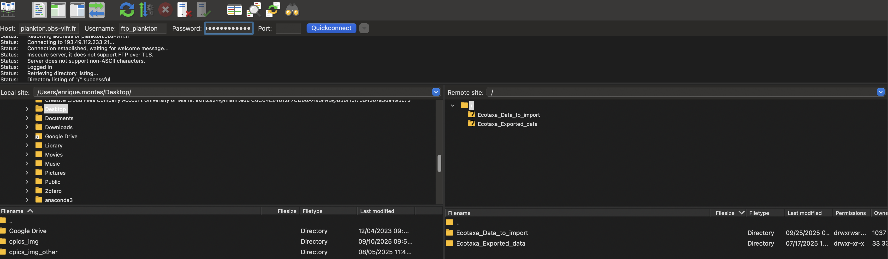

# Instructions for processing and publishing data on EcoTaxa, and updating metadata 

You will need Filezilla FTP software to upload data to EcoTaxa: <https://filezilla-project.org/download.php?type=client>.

-   Connect to EcoTaxa server:

{width="695"}

-   Search for your folder under 'Ecotaxa_data_to_import'. If you don't see your folder in it, create one:

-   Drag and drop .zip files into your folder. Note that the .zip file name **must** be 'ecotaxa\_\*.zip'.

-   Use 'ecotaxa_metadata_editor.rmd' to edit metadata contained in .tsv files in batch:

    -   This routine will create a .zip file containing all modified .tsv tables

    -   Go to the code chunk '**Create a zip file containing all modified .tsv files to upload to Ecotaxa**'

    -   The .zip file containing all modified .tsv tables will be created in the Desktop as 'ecotaxa_tsv_archive.zip'

-   Drag and drop 'ecotaxa_tsv_archive.zip' to 'sfer_noaa'

-   Go to the EcoTaxa project \> import images and metadata:

    -   Use GENERAL IMPORT for uploading new segments

    -   Select the tab 'Choose a folder or zip file on the server'

    -   Check boxes below as needed

-   For updating metadata select 'UPDATE METADATA'

-   DONE: all metadata will be updated in batch with content from 'ecotaxa_tsv_archive.zip'
